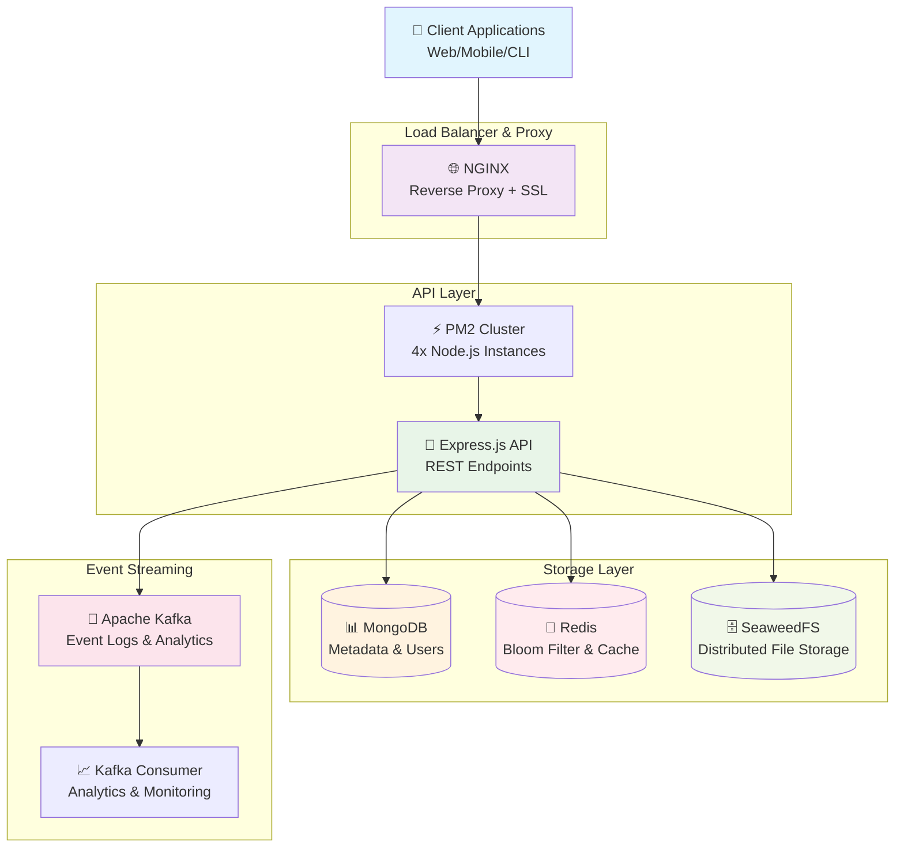
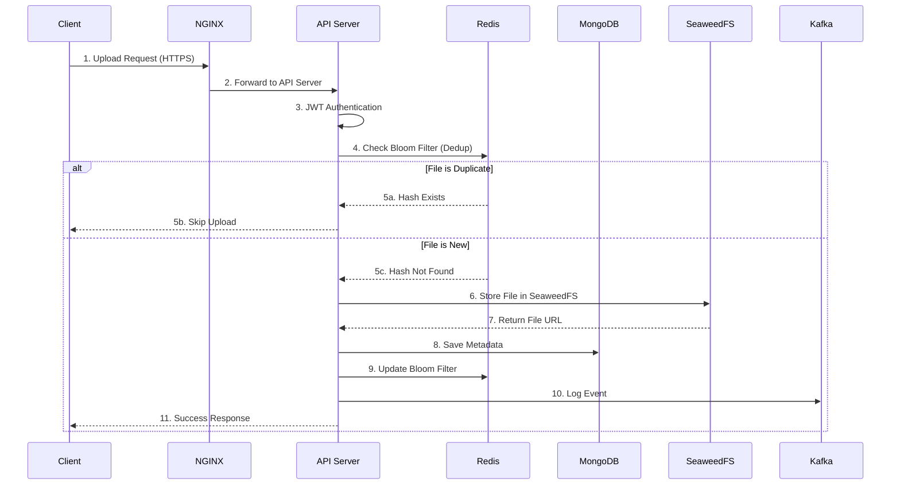
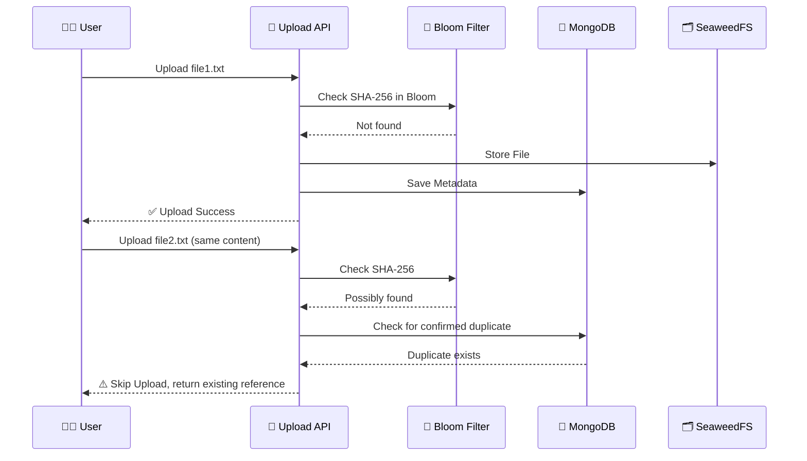
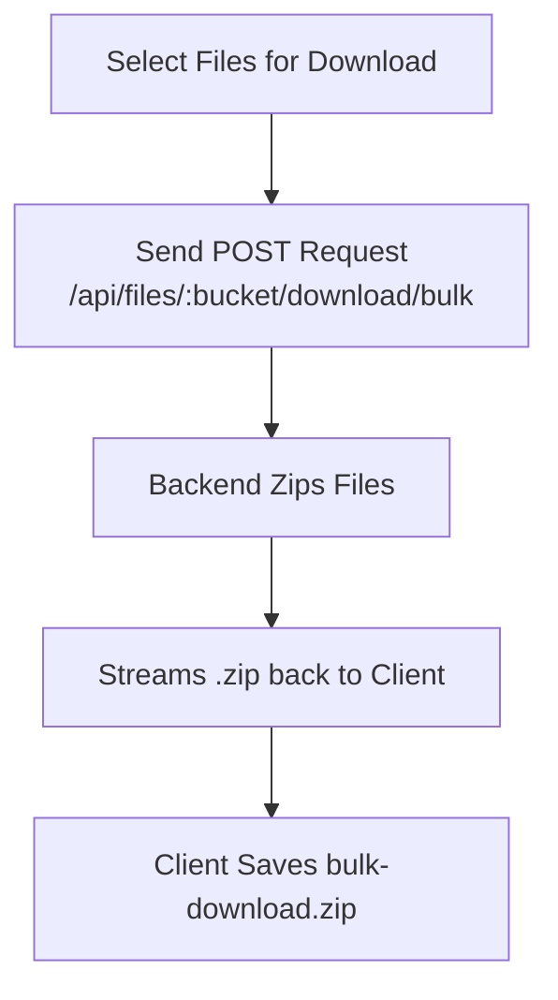
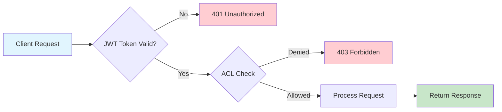
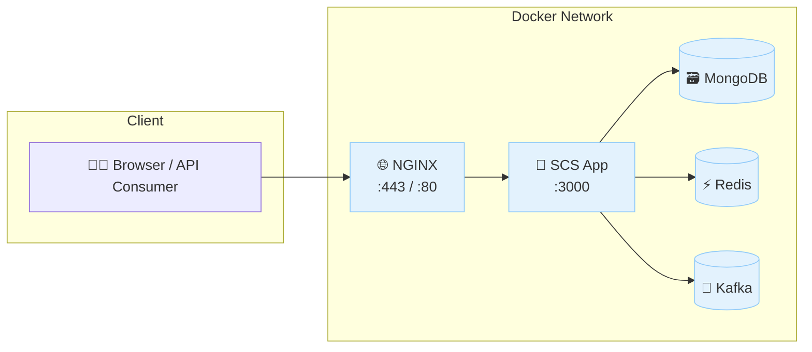
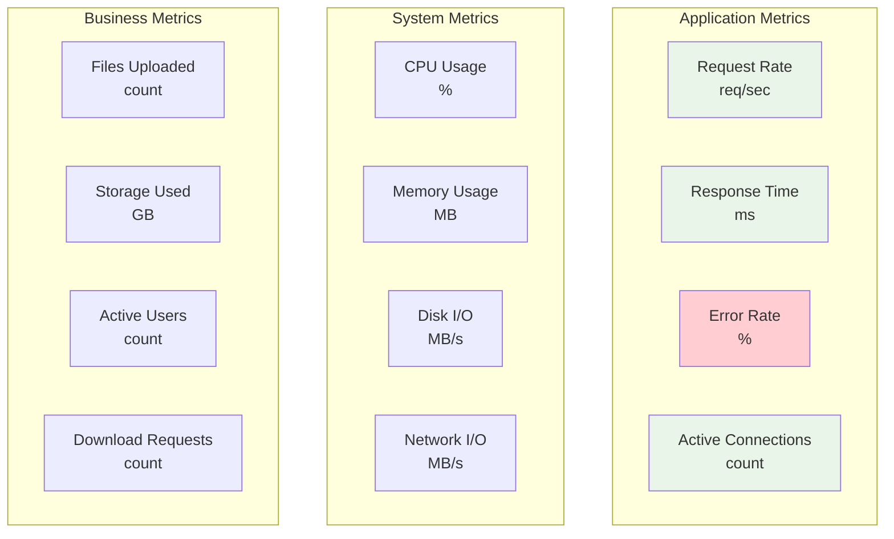

# 🚀 Simple Cloud Storage (SCS)
### *A Production-Grade Amazon S3 Clone - Backend Engineering Capstone Project*

[](https://nodejs.org/)
[](https://mongodb.com/)
[](https://redis.io/)
[](https://github.com/seaweedfs/seaweedfs)
[](LICENSE)

---

## 📋 Table of Contents
- [🎯 Project Overview](#-project-overview)
- [✨ Key Features](#-key-features)
- [🏗️ System Architecture](#-system-architecture)
- [🛠️ Technology Stack](#-technology-stack)
- [📁 Project Structure](#-project-structure)
- [⚡ Quick Start](#-quick-start)
- [🔧 Installation & Setup](#-installation--setup)
- [📚 API Documentation](#-api-documentation)
- [🧪 Usage Examples](#-usage-examples)
- [🔐 Security Features](#-security-features)
- [🐳 Docker Deployment](#-docker-deployment)
- [📊 Monitoring & Analytics](#-monitoring--analytics)

---

## 🎯 Project Overview

**Simple Cloud Storage (SCS)** is a comprehensive Amazon S3 clone built as a capstone project for the Backend Engineering Launchpad program. This project demonstrates deep understanding of distributed systems, cloud storage architecture, and modern backend development practices.

### 🎓 **Educational Goals**
- Master **distributed file storage** principles
- Implement **scalable microservices** architecture  
- Learn **cloud storage internals** (metadata, versioning, ACLs)
- Practice **system design** for high-availability services
- Build **production-ready** backend systems

### 🌟 **Key Achievements**
- ✅ **Full S3 API Compatibility** - Upload, download, versioning, metadata
- ✅ **Enterprise Security** - JWT auth, ACLs, encrypted storage
- ✅ **Production Scalability** - Horizontal scaling, load balancing
- ✅ **Advanced Features** - Deduplication, event streaming, analytics
- ✅ **Modern DevOps** - Docker, NGINX, PM2 clustering

---

## ✨ Key Features

<div align="center">

| Feature | Description | Status |
|---------|-------------|--------|
| 🗂️ **Bucket Management** | Create, list, and manage storage buckets | ✅ Complete |
| 📁 **File Operations** | Upload, download, delete with metadata | ✅ Complete |
| 🔄 **Version Control** | Automatic file versioning and rollback | ✅ Complete |
| 🔗 **File Sharing** | Public links with expiration control | ✅ Complete |
| 🔐 **Access Control** | Granular ACL permissions (Read/Write/Owner) | ✅ Complete |
| 🚫 **Deduplication** | SHA-256 based duplicate detection | ✅ Complete |
| 📊 **Event Logging** | Real-time Kafka event streaming | ✅ Complete |
| 🌐 **HTTPS Support** | NGINX reverse proxy with SSL | ✅ Complete |
| ⚡ **High Performance** | PM2 clustering and Redis caching | ✅ Complete |

</div>

---

## 🏗️ System Architecture

### High-Level Architecture Diagram



### Data Flow Architecture



---

## 🛠️ Technology Stack

<div align="center">

### Backend Technologies


### Databases & Storage


### Infrastructure & DevOps


</div>

---

## 📁 Project Structure

```
vnihar007-scs/
├── 📁 src/                          # Source code directory
│   ├── 🎮 controllers/              # Business logic layer
│   │   ├── authController.js        # User authentication & JWT logic
│   │   ├── bucketController.js      # Bucket creation, listing, deletion
│   │   ├── fileController.js        # File operations (CRUD)
│   │   ├── uploadController.js      # File upload logic to SeaweedFS
│   │   ├── aclController.js         # Access control layer
│   │   ├── shareLinkController.js   # File sharing & link generation
│   │   └── analyticsController.js   # Storage usage, user activity, metrics
│
│   ├── 📋 models/                   # MongoDB schema definitions
│   │   ├── User.js                  # User schema
│   │   ├── Bucket.js                # Bucket schema
│   │   ├── File.js                  # Object metadata schema
│   │   ├── ACL.js                   # Access control list schema
│   │   ├── ShareLink.js             # Shared link schema
│   │   └── ActivityLog.js           # Logs of user/file actions
│
│   ├── 🛣️ routes/                   # API endpoints
│   │   ├── auth.js                  # /api/auth
│   │   ├── buckets.js               # /api/buckets
│   │   ├── files.js                 # /api/files
│   │   ├── upload.js                # /api/upload
│   │   ├── acl.js                   # /api/acl
│   │   ├── Link.js                  # /api/share
│   │   └── analytics.js             # /api/analytics
│
│   ├── 🛡️ middleware/               # Express middlewares
│   │   ├── auth.js                  # JWT validation
│   │   └── acl.js                   # ACL checks per resource
│
│   ├── 🔧 utils/                    # Utility modules
│   │   ├── Token_gen.js             # JWT token generator
│   │   ├── redis.js                 # Redis & Bloom setup
│   │   ├── bloomFilter.js           # Bloom filter helpers
│   │   ├── aclCheck.js              # Fine-grained ACL checker
│   │   ├── uploadToSeaweed.js       # SeaweedFS uploader
│   │   └── kafka/                   # Kafka integrations
│   │       ├── kafkaClient.js       # KafkaJS client
│   │       ├── ProduceEvent.js      # Kafka producer
│   │       └── Consumer.js          # Kafka consumer
│
│   ├── 🌐 services/                 # External service configurations
│   │   ├── nginx/                   # Reverse proxy setup
│   │   │   ├── nginx.conf           # NGINX config file
│   │   │   └── ssl/                 # SSL/TLS certs
│   │   │       ├── selfsigned.crt   # Self-signed certificate
│   │   │       └── selfsigned.key   # Private key
│
│   ├── 🧪 tests/                    # Test suite
│   │   ├── analytics/               # Analytics tests
│   │   │   └── storageAnalytics.test.js
│   │   ├── controllers/             # Controller unit tests
│   │   │   ├── fileController.test.js
│   │   │   └── uploadFiles.test.js
│   │   └── middleware/              # Middleware tests
│   │       └── aclMiddleware.test.js
│
│   └── 🚀 index.js                  # Main app entry point
│
├── 🐳 docker/                       # Docker environment
│   ├── kafka-stack/                 # Kafka container stack
│   │   └── docker-compose.yml
│
├── ⚙️ .env.test                     # Test environment variables
├── ⚙️ .env.example                  # Sample .env config
├── 📦 package.json                  # Node dependencies & scripts
├── 📖 README.md                     # Project documentation
└── 📦 package-lock.json             # Dependency lock file
```

---

## ⚡ Quick Start

### Prerequisites
- **Node.js** 18+ 
- **MongoDB** 6.0+
- **Redis** 7.0+
- **Docker** & **Docker Compose**

### 1️⃣ Clone & Install
```bash
git clone https://github.com/vNihar007/simple-cloud-storage.git
cd simple-cloud-storage
npm install
```

### 2️⃣ Environment Setup
```bash
# Copy environment template
cp .env.example .env

# Edit with your configurations
nano .env
```

### 3️⃣ Start Services
```bash
# Start Kafka stack
docker-compose -f kafka-stack/docker-compose.yml up -d

# Start MongoDB & Redis (if not running)
brew services start mongodb/brew/mongodb-community
brew services start redis

# Start the application
npm run dev
```

### 4️⃣ Test the API
```bash
# Health check
curl http://localhost:3000/health

# Expected response
{"status": "OK", "timestamp": "2025-06-06T13:20:00Z"}
```

---

## 🔧 Installation & Setup

### Environment Variables

Create a `.env` file in the project root:

```bash
# Database Configuration
MONGOOSE_URI=mongodb://localhost:27017/scs
REDIS_URL=redis://localhost:6379

# Authentication
JWT_SECRET=your-super-secure-jwt-secret-key-here
JWT_EXPIRES_IN=24h

# Kafka Configuration
KAFKA_BROKERS=localhost:9092
KAFKA_TOPIC=file-events

# SeaweedFS Configuration
SEAWEEDFS_MASTER=localhost:9333
SEAWEEDFS_VOLUME=localhost:8080

# Server Configuration
PORT=3000
NODE_ENV=development

# NGINX Configuration (for production)
NGINX_PORT=443
SSL_CERT_PATH=/path/to/ssl/cert
SSL_KEY_PATH=/path/to/ssl/key
```

### Database Setup

```bash
# Connect to MongoDB
mongosh

# Create database and collections
use scs;
db.createCollection("users");
db.createCollection("buckets");
db.createCollection("files");
db.createCollection("acls");

# Create indexes for better performance
db.files.createIndex({"bucket": 1, "filename": 1});
db.files.createIndex({"hash": 1});
db.acls.createIndex({"resourceId": 1, "userId": 1});
```

### Production Deployment

```bash
# Build for production
npm run build

# Start with PM2 cluster
npm run cluster

# Setup NGINX reverse proxy
sudo cp src/services/nginx/nginx.conf /etc/nginx/sites-available/scs
sudo ln -s /etc/nginx/sites-available/scs /etc/nginx/sites-enabled/
sudo nginx -t && sudo systemctl reload nginx
```

---

## 📚 API Documentation

### Authentication Endpoints

#### Register User
```http
POST /api/auth/register
Content-Type: application/json

{
  "email": "john@example.com",
  "password": "securepassword123",
  "name": "John Doe"
}
```

**Response:**
```json
{
  "success": true,
  "token": "eyJhbGciOiJIUzI1NiIsInR5cCI6IkpXVCJ9...",
  "user": {
    "id": "65f1a2b3c4d5e6f7g8h9i0j1",
    "email": "john@example.com",
    "name": "John Doe"
  }
}
```

#### Login User
```http
POST /api/auth/login
Content-Type: application/json

{
  "email": "john@example.com",
  "password": "securepassword123"
}
```

### Bucket Management

#### Create Bucket
```http
POST /api/bucket/buckets
Authorization: Bearer <jwt-token>
Content-Type: application/json

{
  "name": "my-project-bucket",
  "description": "Storage for project files",
  "isPublic": false
}
```

#### List Buckets
```http
GET /api/bucket/buckets
Authorization: Bearer <jwt-token>
```

**Response:**
```json
{
  "success": true,
  "buckets": [
    {
      "id": "65f1a2b3c4d5e6f7g8h9i0j1",
      "name": "my-project-bucket",
      "description": "Storage for project files",
      "isPublic": false,
      "createdAt": "2025-06-06T10:30:00Z",
      "fileCount": 15,
      "totalSize": "2.5 MB"
    }
  ]
}
```

### File Operations

#### Upload Files
```http
POST /api/upload/:bucketName/upload
Authorization: Bearer <jwt-token>
Content-Type: multipart/form-data

files: [file1.pdf, file2.jpg]
folder: "documents/reports"
tags: "project,2025,important"
versionReason: "Updated quarterly report"
```

**Response:**
```json
{
  "success": true,
  "message": "2 files uploaded successfully",
  "files": [
    {
      "id": "65f1a2b3c4d5e6f7g8h9i0j1",
      "filename": "report.pdf",
      "originalName": "Q1_Report.pdf",
      "size": 1048576,
      "contentType": "application/pdf",
      "version": "v3",
      "hash": "sha256:a1b2c3d4e5f6...",
      "folder": "documents/reports",
      "tags": ["project", "2025", "important"],
      "uploadedAt": "2025-06-06T14:30:00Z"
    }
  ]
}
```

#### Download File
```http
GET /api/files/:bucketName/:fileId/download
Authorization: Bearer <jwt-token>
```

#### Search Files
```http
GET /api/files/:bucketName/search/query?q=report&tags=project&folder=documents
Authorization: Bearer <jwt-token>
```

### File Versioning

#### List File Versions
```http
GET /api/files/:bucketName/versions/:filename
Authorization: Bearer <jwt-token>
```

**Response:**
```json
{
  "success": true,
  "filename": "report.pdf",
  "versions": [
    {
      "version": "v3",
      "size": 1048576,
      "hash": "sha256:a1b2c3d4e5f6...",
      "reason": "Updated quarterly report",
      "uploadedAt": "2025-06-06T14:30:00Z",
      "isCurrent": true
    },
    {
      "version": "v2",
      "size": 987654,
      "hash": "sha256:b2c3d4e5f6a1...",
      "reason": "Added financial data",
      "uploadedAt": "2025-06-05T10:15:00Z",
      "isCurrent": false
    }
  ]
}
```

#### Rollback to Previous Version
```http
POST /api/files/:bucketName/:filename/version/:versionLabel/rollback
Authorization: Bearer <jwt-token>
```

### File Sharing

#### Create Public Share Link
```http
POST /api/link/:fileId/:bucketName/share
Authorization: Bearer <jwt-token>
Content-Type: application/json

{
  "expiresInMinutes": 60,
  "description": "Sharing Q1 report"
}
```

**Response:**
```json
{
  "success": true,
  "shareLink": "https://yourdomain.com/public/my-project-bucket/abc123-def456-ghi789",
  "expiresAt": "2025-06-06T15:30:00Z",
  "accessCount": 0
}
```

### Access Control (ACL)

#### Grant Access Permission
```http
POST /api/acl/assign-owner
Authorization: Bearer <jwt-token>
Content-Type: application/json

{
  "resourceId": "65f1a2b3c4d5e6f7g8h9i0j1",
  "resourceType": "file",
  "userEmail": "collaborator@example.com",
  "permission": "read"
}
```

---

## 🧪 Usage Examples

### Example 1: Complete File Upload Workflow

```bash
#!/bin/bash

# 1. Register a new user
curl -X POST http://localhost:3000/api/auth/register \
  -H "Content-Type: application/json" \
  -d '{
    "email": "demo@example.com",
    "password": "password123",
    "name": "Demo User"
  }'

# 2. Login and get JWT token
TOKEN=$(curl -X POST http://localhost:3000/api/auth/login \
  -H "Content-Type: application/json" \
  -d '{
    "email": "demo@example.com",
    "password": "password123"
  }' | jq -r '.token')

# 3. Create a bucket
curl -X POST http://localhost:3000/api/bucket/buckets \
  -H "Authorization: Bearer $TOKEN" \
  -H "Content-Type: application/json" \
  -d '{
    "name": "demo-bucket",
    "description": "Demo bucket for testing"
  }'

# 4. Upload a file
curl -X POST http://localhost:3000/api/upload/demo-bucket/upload \
  -H "Authorization: Bearer $TOKEN" \
  -F "files=@./sample.pdf" \
  -F "folder=documents" \
  -F "tags=demo,test"

# 5. List bucket contents
curl -X GET http://localhost:3000/api/bucket/buckets/demo-bucket/objects \
  -H "Authorization: Bearer $TOKEN"
```
---

### 📁 Example 2 File Deduplication Logic

> **Goal:** Upload two files with identical content and prevent redundant storage via SHA-256 + Bloom Filter check.

#### 🔄 Flow Overview



#### ✅ What’s Being Validated:

* SHA-256 hash is reused to detect identical content.
* Bloom filter offers a **fast, memory-efficient** check.
* MongoDB stores metadata like file ID, owner, timestamps.

#### 🧪 Run Test

```bash
# Run the deduplication test script
node test-deduplication.js
```

> **Tip:** The second upload should be skipped and reference the original file.
> 🔍 Check terminal logs for `Second upload (should be skipped):` to verify.

---

### 📦 Example 3: Bulk Download via Node.js

> **Goal:** Fetch multiple files at once and download them as a single `.zip`.

#### 📥 Workflow Overview



#### 🧪 Run Script

```bash
# Download selected files from a bucket as a zip archive
node bulk-download.js
```

> Ensure that the `fileIds` array and JWT token are correctly populated.

---

### 📂 Code Location Reference

| Example                 | File                                               |
| ----------------------- | -------------------------------------------------- | 
| 📦 Bulk Download Script | [`bulk-download.js`](./bulk-download.js)           |

---

## 🔐 Security Features

### Authentication & Authorization



### Security Checklist

- ✅ **JWT Authentication** - Secure token-based auth
- ✅ **Password Hashing** - bcrypt with salt rounds
- ✅ **Input Validation** - Joi schema validation
- ✅ **SQL Injection Prevention** - Mongoose ODM protection
- ✅ **CORS Configuration** - Controlled cross-origin requests
- ✅ **Rate Limiting** - Express rate limiter middleware
- ✅ **HTTPS Enforcement** - NGINX SSL termination
- ✅ **File Type Validation** - Whitelist allowed file types
- ✅ **Access Control Lists** - Granular permissions
- ✅ **Secure Headers** - Helmet.js security headers

### ACL Permission Matrix

| Resource Type | Owner | Write | Read | Public |
|---------------|-------|--------|------|--------|
| **Create** | ✅ | ❌ | ❌ | ❌ |
| **Read** | ✅ | ✅ | ✅ | ✅* |
| **Update** | ✅ | ✅ | ❌ | ❌ |
| **Delete** | ✅ | ❌ | ❌ | ❌ |
| **Share** | ✅ | ✅ | ❌ | ❌ |
| **Version Control** | ✅ | ❌ | ❌ | ❌ |

*Public access only via share links

---

Perfect — here's a **complete Docker Deployment section** for your `README.md` that includes:

* ✅ A professional technical breakdown of services
* 🗺️ A Mermaid diagram to show container interactions
* 🧰 A `Makefile` to simplify Docker commands
* 📦 All deployment info (dev and prod)
* 🛑 Kubernetes references removed

---

## 🐳 Docker Deployment 

This project uses **Docker Compose** for managing multi-service infrastructure, enabling quick bootstrapping in both development and production environments.

---

### 🧱 Architecture Overview



---

### ⚙️ Development Setup (`docker-compose.dev.yml`)

Use this setup when you're actively developing the project.

#### 🔧 Services:

| Service | Role                                 | Port(s) | Persistent Volume  |
| ------- | ------------------------------------ | ------- | ------------------ |
| `app`   | Node.js backend server               | 3000    | Yes (mounted code) |
| `mongo` | MongoDB instance                     | 27017   | ✅ `mongo_data`     |
| `redis` | In-memory caching                    | 6379    | ✅ `redis_data`     |
| `kafka` | Event streaming (Bitnami KRaft mode) | 9092    | ✅ `kafka_data`     |
| `nginx` | HTTPS reverse proxy with SSL         | 80, 443 | ❌                  |

#### 🔑 Custom Files:

* SSL certs: `./src/services/nginx/ssl/selfsigned.crt`, `.key`
* Config: `./src/services/nginx/nginx.conf`

---

### 🚀 Production Deployment

#### 📦 1. Build Docker Image

```bash
docker build -t scs:latest .
```

#### 🔁 2. Launch Using Production Compose

```bash
docker-compose -f docker-compose.prod.yml up -d
```

#### ⚖️ 3. Scale the App (Optional)

```bash
docker-compose -f docker-compose.prod.yml up -d --scale app=4
```

> Make sure NGINX or a load balancer routes traffic properly across scaled containers.

---

### 🧰 Optional: Makefile for Easier Commands

Create a `Makefile` in the root directory:

```Makefile
# Makefile

# Development
dev-up:
	docker-compose -f docker-compose.dev.yml up -d

dev-down:
	docker-compose -f docker-compose.dev.yml down

# Production
prod-build:
	docker build -t scs:latest .

prod-up:
	docker-compose -f docker-compose.prod.yml up -d

prod-scale:
	docker-compose -f docker-compose.prod.yml up -d --scale app=4

prod-down:
	docker-compose -f docker-compose.prod.yml down

logs:
	docker-compose logs -f --tail=100
```

#### 📦 Usage

```bash
make dev-up        # Start dev stack
make prod-up       # Run production stack
make logs          # Tail logs from all services
```

---

### 📚 Environment Configuration

Ensure your `.env` (or `.env.example`) includes:

```env
NODE_ENV=development
PORT=3000
MONGOOSE_URI=mongodb://mongo:27017/scs
REDIS_URL=redis://redis:6379
JWT_SECRET=your-secret-key
```

---

## 📊 Monitoring & Analytics

### Performance Metrics Dashboard



### Kafka Event Analytics

```javascript
// kafka-consumer-analytics.js
const { Kafka } = require('kafkajs');

const kafka = Kafka({
  clientId: 'analytics-consumer',
  brokers: ['localhost:9092']
});

const consumer = kafka.consumer({ groupId: 'analytics-group' });

async function startAnalytics() {
  await consumer.connect();
  await consumer.subscribe({ topic: 'file-events' });
  
  await consumer.run({
    eachMessage: async ({ topic, partition, message }) => {
      const event = JSON.parse(message.value.toString());
      
      // Process different event types
      switch (event.event) {
        case 'upload':
          await trackUpload(event);
          break;
        case 'download':
          await trackDownload(event);
          break;
        case 'share':
          await trackShare(event);
          break;
        case 'delete':
          await trackDelete(event);
          break;
      }
    },
  });
}

async function trackUpload(event) {
  console.log(`📁 File uploaded: ${event.filename} (${event.size} bytes)`);
  // Update analytics database
  // Send to monitoring service
}

startAnalytics().catch(console.error);
```

### Health Check Endpoint

```javascript
// health-check.js
app.get('/health', async (req, res) => {
  const health = {
    status: 'OK',
    timestamp: new Date().toISOString(),
    uptime: process.uptime(),
    environment: process.env.NODE_ENV,
    version: process.env.npm